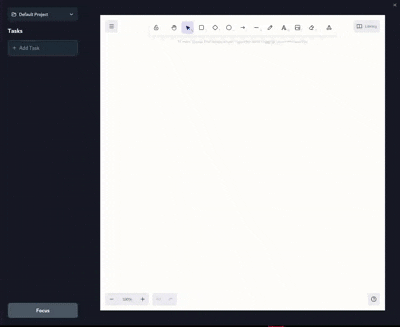

# MissionControl 🚀

A minimalistic, always-on-top task manager and Pomodoro timer built with Tauri, React, and TypeScript. MissionControl helps you stay focused and productive with a clean, distraction-free interface.



## ✨ Features

### 📝 Task Management
- **Create Tasks**: Quick task creation with default 25-minute time allocation
- **Edit Tasks**: Inline editing of both task text and time duration
- **Complete Tasks**: Mark tasks as done with visual feedback
- **Delete Tasks**: Remove tasks you no longer need

### ⏱️ Focus Timer
- **Pomodoro Integration**: Each task comes with customizable time (default: 25 minutes)
- **Countdown Timer**: Real-time countdown display in MM:SS format
- **Auto-Advance**: Automatically moves to the next task when timer completes

### 🎮 Focus Mode Controls
- **Focus Button**: Enter focus mode with the first incomplete task
- **Skip**: Jump to the next task in your list
- **Pause/Resume**: Pause and resume your focus session
- **Done**: Mark current task complete and move to next
- **Todo**: Return to task list view

### 🎨 User Experience
- **Always On Top**: Stays visible above other applications
- **Compact Design**: Minimal screen real estate usage
- **Smooth Animations**: Framer Motion powered transitions
- **Drag & Drop**: Move the window anywhere on your screen
- **Responsive UI**: Clean hover states and visual feedback

### 🖥️ System Integration
- **Cross Platform**: Built with Tauri for Windows, macOS, and Linux
- **Native Performance**: Rust backend for speed and efficiency
- **Transparent Window**: Seamless desktop integration
- **No Taskbar**: Non-intrusive presence in your workflow

## 🚀 Getting Started

### Prerequisites
- [Node.js](https://nodejs.org/) (v16 or higher)
- [Rust](https://rustup.rs/) (latest stable)
- [Tauri CLI](https://tauri.app/v1/guides/getting-started/prerequisites)

### Installation

1. **Clone the repository**
   ```bash
   git clone https://github.com/ITPATJIDR/MissionControl.git
   cd MissionControl
   ```

2. **Install dependencies**
   ```bash
   npm install
   ```

3. **Run in development mode**
   ```bash
   npm run tauri dev
   ```

4. **Build for production**
   ```bash
   npm run tauri build
   ```

## 🎯 Usage

1. **Create Tasks**: Click "Add Task" to create new todo items
2. **Set Time**: Click on the time display (e.g., "25min") to customize duration
3. **Enter Focus Mode**: Click the "Focus" button to start your session
4. **Use Controls**: Hover over the collapsed window to access Skip, Pause, and Done buttons
5. **Stay Productive**: Let MissionControl guide you through your tasks with timed focus sessions

## 🛠️ Tech Stack

- **Frontend**: React 18 + TypeScript
- **Backend**: Rust + Tauri
- **Styling**: Tailwind CSS
- **Animations**: Framer Motion
- **Icons**: Lucide React
- **Build Tool**: Vite

## �� Project Structure
```
MissionControl/
├── src/
│ ├── components/
│ │ └── ui/
│ │ ├── todo_item.tsx
│ │ ├── todo_list.tsx
│ │ ├── focus_state.tsx
│ │ ├── collapse_state.tsx
│ │ └── hover_buttons.tsx
│ ├── App.tsx
│ └── main.tsx
├── src-tauri/
│ ├── src/
│ └── Cargo.toml
├── assets/
└── README.md
```

## 🤝 Contributing

We welcome contributions! Here's how you can help make MissionControl better:

### Ways to Contribute
- 🐛 **Bug Reports**: Found a bug? Open an issue with details
- 💡 **Feature Requests**: Have an idea? We'd love to hear it
- 📝 **Documentation**: Help improve our docs
- 🔧 **Code Contributions**: Submit pull requests for fixes or features

### Development Workflow

1. **Fork the repository**
2. **Create a feature branch**
   ```bash
   git checkout -b feature/amazing-feature
   ```
3. **Make your changes**
4. **Test thoroughly**
5. **Commit with clear messages**
   ```bash
   git commit -m "Add amazing feature: detailed description"
   ```
6. **Push to your fork**
   ```bash
   git push origin feature/amazing-feature
   ```
7. **Open a Pull Request**

### Code Guidelines
- Follow TypeScript best practices
- Use meaningful component and variable names
- Add comments for complex logic
- Ensure responsive design principles
- Test on multiple platforms when possible

### Setting up Development Environment
```bash
# Clone your fork
git clone https://github.com/ITPATJIDR/MissionControl.git

# Install dependencies
npm install

# Start development server
npm run tauri dev

# Run linting
npm run lint

# Build for testing
npm run tauri build
```

## 💖 Support MissionControl

If MissionControl helps boost your productivity, consider supporting its development:

### 🎯 How Your Support Helps
- 🚀 **Faster Development**: More time dedicated to new features
- 🐛 **Better Quality**: Thorough testing and bug fixes
- 📱 **More Platforms**: Expanding to mobile and web
- 🎨 **Enhanced UI/UX**: Professional design improvements

### 💝 Ways to Support

#### 💰 Financial Support
- **GitHub Sponsors**: [Sponsor on GitHub](https://github.com/sponsors/yourusername)
- **Buy Me a Coffee**: [Support the developer](https://buymeacoffee.com/yourusername)
- **PayPal**: [One-time donation](https://paypal.me/yourusername)

#### 🌟 Non-Financial Support
- ⭐ **Star the Repository**: Show your appreciation
- 🐦 **Share on Social Media**: Help others discover MissionControl
- 📝 **Write a Review**: Share your experience
- 🤝 **Contribute Code**: Help build features you want to see

### 🏆 Sponsors

*Your name could be here! Become a sponsor to support MissionControl's development.*

## 📋 Roadmap

### 🎯 Upcoming Features
- [ ] **Task Categories**: Organize tasks by project or type
- [ ] **Statistics Dashboard**: Track your productivity over time
- [ ] **Custom Themes**: Personalize your MissionControl experience
- [ ] **Keyboard Shortcuts**: Speed up your workflow
- [ ] **Task Templates**: Quick creation of recurring tasks
- [ ] **Break Reminders**: Healthy work-break cycles
- [ ] **Cloud Sync**: Access your tasks across devices

### 🔮 Future Vision
- Mobile companion app
- Team collaboration features
- Advanced analytics
- Integration with popular productivity tools

## 📄 License

This project is licensed under the MIT License - see the [LICENSE](LICENSE) file for details.

## 🙏 Acknowledgments

- **Tauri Team**: For the amazing framework
- **React Community**: For the robust ecosystem
- **Contributors**: Everyone who helps improve MissionControl
- **Users**: For your feedback and support

---

<div align="center">

**Made with ❤️ by the MissionControl team**

[⭐ Star on GitHub](https://github.com/yourusername/MissionControl) • [🐛 Report Bug](https://github.com/yourusername/MissionControl/issues) • [💡 Request Feature](https://github.com/yourusername/MissionControl/issues)

</div>